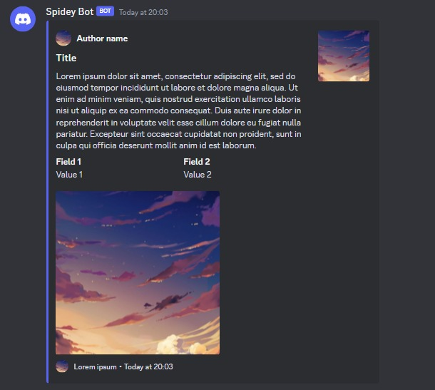
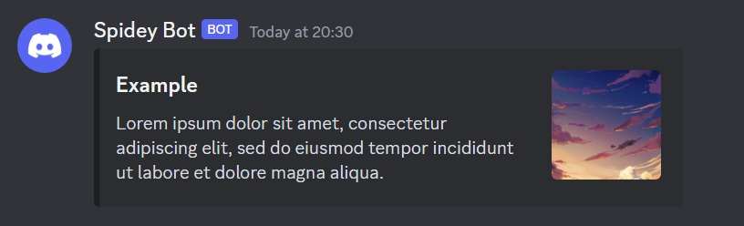

# discord_hook

An easy way to use Discord webhook with Deno.

## Import

> Note: This module requires `--allow-net` and `--allow-read` flags to run.

```ts
// import via Deno
import * as discordhook from "https://deno.land/x/discord_hook@$VERSION/mod.ts";

// import via Github
import * as discordhook from "https://raw.githubusercontent.com/babiabeo/discord_hook/main/mod.ts";
```

## Examples

- [Execute webhook](#execute-webhook)
  - [With embed](#with-embed)
  - [With files/attachments](#with-filesattachments)
  - [Embed with attachment](#embed-with-attachment)
- [Edit message](#edit-message)
- [Delete message](#delete-message)

For more, see [examples](./examples).

### Execute webhook

```ts
import { DiscordWebhook } from "https://deno.land/x/discord_hook@$VERSION/mod.ts";

const webhook = new DiscordWebhook({
  url: "your webhook url",
});

await webhook.execute({ content: "Hello World" });
```


#### With embed

```ts
import {
  DiscordEmbed,
  DiscordWebhook,
} from "https://deno.land/x/discord_hook@$VERSION/mod.ts";

const webhook = new DiscordWebhook({
  url: "your webhook url",
});

const img = "image url";
const embed = new DiscordEmbed()
  .setAuthor({
    name: "Author name",
    iconUrl: img,
  })
  .setColor(0x5865f2)
  .setTitle("Title")
  .setDescription(
    "Lorem ipsum dolor sit amet, consectetur adipiscing elit, sed do eiusmod tempor incididunt ut labore et dolore magna aliqua. Ut enim ad minim veniam, quis nostrud exercitation ullamco laboris nisi ut aliquip ex ea commodo consequat. Duis aute irure dolor in reprehenderit in voluptate velit esse cillum dolore eu fugiat nulla pariatur. Excepteur sint occaecat cupidatat non proident, sunt in culpa qui officia deserunt mollit anim id est laborum.",
  )
  .addFields([
    { name: "Field 1", value: "Value 1", inline: true },
    { name: "Field 2", value: "Value 2", inline: true },
  ])
  .setThumbnail(img)
  .setImage(img)
  .setFooter({
    text: "Lorem ipsum",
    iconUrl: img,
  })
  .setTimestamp();

await webhook.execute({ embeds: [embed] });
```



#### With files/attachments

```ts
import {
  Attachment,
  DiscordWebhook,
} from "https://deno.land/x/discord_hook@$VERSION/mod.ts";

const webhook = new DiscordWebhook({
  url: "your webhook url",
});

const file = new Attachment({
  source: "file path or url",
});

await webhook.execute({
  content: "An image was sent",
  files: [file],
});
```


#### Embed with attachment

```ts
import {
  Attachment,
  DiscordEmbed,
  DiscordWebhook,
} from "https://deno.land/x/discord_hook@$VERSION/mod.ts";

const webhook = new DiscordWebhook({
  url: "your webhook url",
});

const file = new Attachment({
  name: "example_image.png",
  source: "file path or url",
});

const embed = new DiscordEmbed()
  .setTitle("Example")
  .setDescription(
    "Lorem ipsum dolor sit amet, consectetur adipiscing elit, sed do eiusmod tempor incididunt ut labore et dolore magna aliqua.",
  )
  .setThumbnail("attachment://example_image.png");

await webhook.execute({
  embeds: [embed],
  files: [file],
});
```



### Edit message

```ts
import { DiscordWebhook } from "https://deno.land/x/discord_hook@$VERSION/mod.ts";

const webhook = new DiscordWebhook({
  url: "your webhook url",
});

await webhook.editMessage({
  messageId: "message id sent by webhook",
  content: "Hello from Deno",
});
```

Before:


After:


### Delete message

```ts
import { DiscordWebhook } from "https://deno.land/x/discord_hook@$VERSION/mod.ts";

const webhook = new DiscordWebhook({
  url: "your webhook url",
});

await webhook.deleteMessage("message id sent by webhook");
```

## Document

The document is available on https://deno.land/x/discord_hook?doc.

## License

[MIT License](LICENSE)
